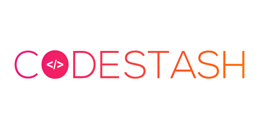

### Welcome To CodeStash!
CodeStash is a project under Opencode'18. On each day  after 12AM we will be adding the problem as an issue and the participants will have to solve the problem (any language) and in the PullRequest mention the link of the online judge so that we can verify your submissions.First person to solve the problem will be awarded 20 points and the rest submissions will be awarded 10 points.  

### NOTE
it is totally upon the mentors to close the issue, you can't make any pull request after the issue is closed.
Once your PR has some mistake and is closed you cant make any further PR's.
All PR's will be reviewed and merged at the end of the day.
Only first 10 PR's will be considered

## Guidelines
Whoever wishes to participate in CodeStash must follow these guidelines,

* Your code name should be of the format "issuenumber_username".
* Mention the issue number along with the Pull Request.
* Comment the link of the online judge along with your PR.
* Do not copy others code, we will be reviewing your code :wink: 
* Submission are encouraged only till 24 Hours and after that the issue will be automatically closed.

## How to contribute
* Create your own fork of the repository. [How to fork a repository?](https://help.github.com/articles/fork-a-repo/)
* Clone your fork. [How to clone a repository?](https://help.github.com/articles/cloning-a-repository/)
* Configure a remote. [How to configure a remote?](https://help.github.com/articles/adding-a-remote/)
* Create your code with the format given above.
* On your local machine, go to the CodeStash folder.
* Go to Solutions folder and a make a new folder (if it's not already there) and name it as your GitHub username.
* Paste the code file in your folder.
* Add, commit and push the changes.
* Create the PR mentioning the issue number.

